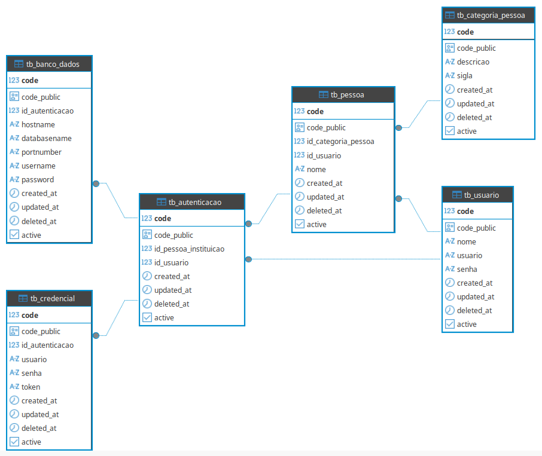

# Credentium

Credentium é um sistema desenvolvido para **gestão centralizada de credenciais**, permitindo organizar, armazenar e recuperar informações de autenticação de forma segura e estruturada.  

O projeto foi idealizado para oferecer um modelo robusto de controle de usuários, instituições (pessoas físicas ou jurídicas), autenticações, credenciais e bancos de dados vinculados.

---

## Informações do Projeto

- **Projeto:** Credentium  
- **Demanda:** CREDENTIUM20250924094941DTB  
- **Objetivo:** Modelar entidades para a funcionalidade de gestão de credenciais  

---

## Funcionalidades

- Cadastro e gerenciamento de usuários.  
- Organização de categorias de pessoas (Pessoa Física e Pessoa Jurídica).  
- Associação entre usuários e pessoas/instituições.  
- Gestão de autenticações por instituição vinculada a usuários.  
- Armazenamento seguro de credenciais (usuário, senha e token opcional).  
- Registro de conexões de banco de dados associadas às autenticações.  
- Controle de ativação, atualização e exclusão lógica de registros.  
- Consultas centralizadas para recuperação de credenciais por usuário.  

---

## Estrutura do Banco de Dados

O sistema foi modelado em **PostgreSQL** utilizando **UUID** como identificadores públicos.  
As principais tabelas são:

- **tb_usuario** → Registra usuários do sistema.  
- **tb_categoria_pessoa** → Define categorias de pessoas (PF, PJ).  
- **tb_pessoa** → Representa pessoas físicas ou jurídicas vinculadas a um usuário.  
- **tb_autenticacao** → Conexão entre pessoa/instituição e usuário.  
- **tb_credencial** → Armazena credenciais de autenticação (usuário/senha/token).  
- **tb_banco_dados** → Registra informações de conexão com banco de dados.  

---

## Modelo de Dados (versão v1.0.0.0)

